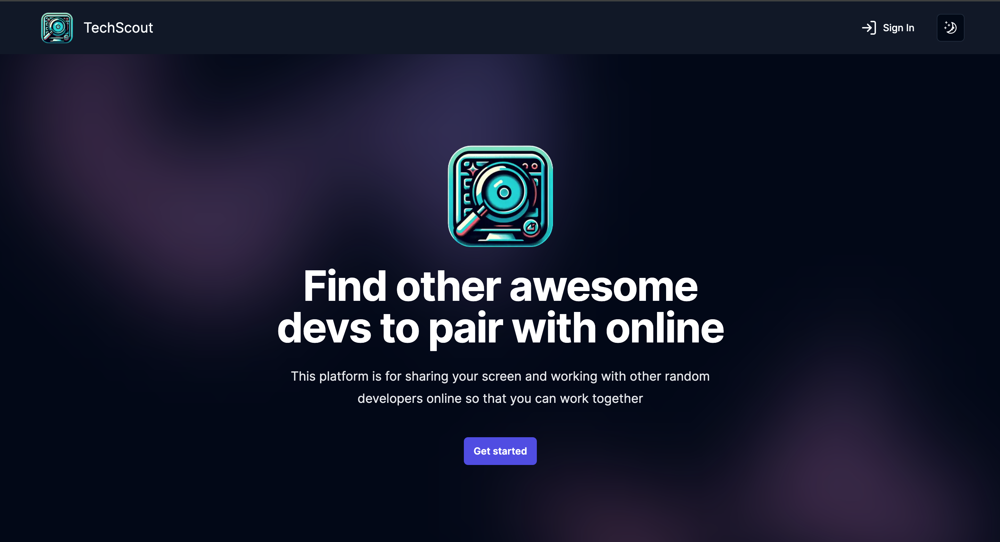
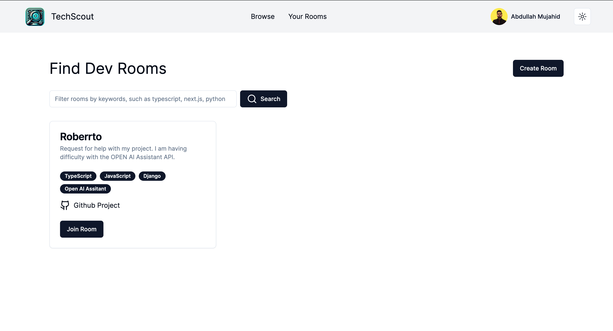
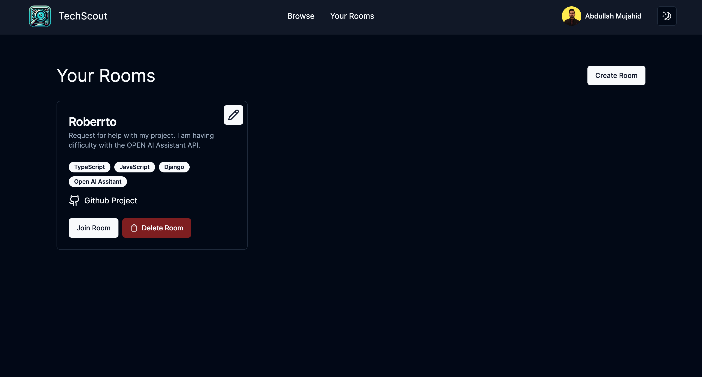
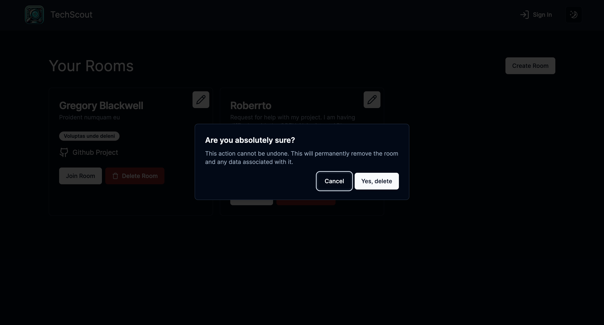
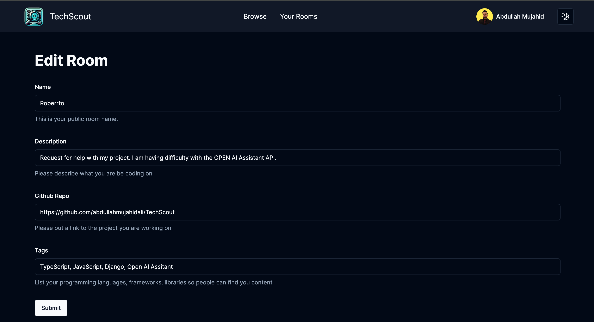
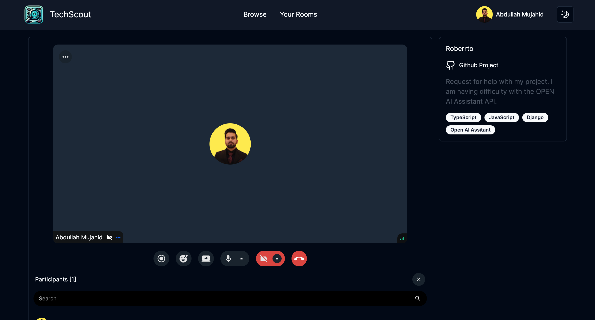

# Tech Scout

Tech Scout is a pair programmer matching service that connects developers with other developers to work on projects together. The service is designed to help developers find other developers to work with on projects, and to help developers find projects to work on.

## Features

- Create a profile
- Create a room
- Live Video Chat
- Live Video Chat Recording

## Technologies

- Next.js (Frontend)
- Next.js (Backend)
- Shadcn & Radix UI (UI)
- TailwindCSS (Styling)
- Stream IO (Video Chat)
- PostgreSQL (Database)

## Installation

1. Clone the repository

```bash
  git clone git@github.com:abdullahmujahidali/TechScout.git
```

2. Install dependencies

```bash
  npm install
```

3. Start the database

```bash
  docker-compose up
```

4. Start the project

```bash
  npm run dev
```

## Screenshots

This is a landing page of the app that shows the features of the app.



This is a browse page of the app that shows the rooms that are available to join in light mode.



This is a user rooms page that shows the rooms that the user has created.



This is a an alert-dialog component that shows the alert message to the user.



This is edit room page that shows the form to edit the room.



This is a room page where user can video chat and record the video chat.



This app is still in development and more features will be added soon.

## Author

Abdullah Mujahid Ali
